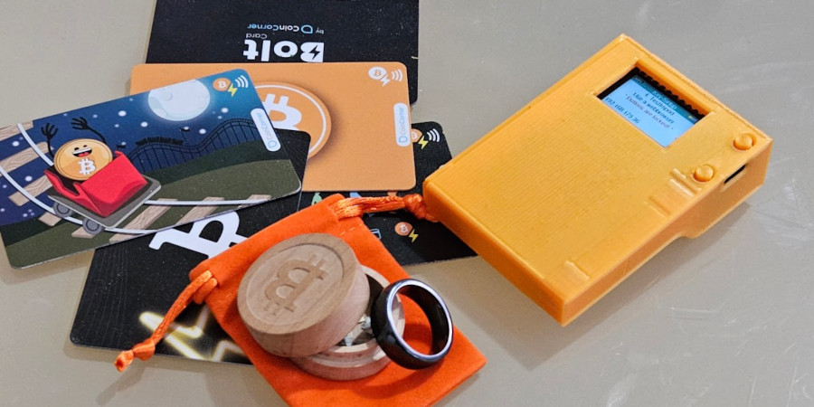

# Bolty - ESP32-based BoltCard provisioning device

Bolty is an ESP32-based device with NFC capabilities designed to provision BoltCards for contactless Bitcoin Lightning Network payments. This repository contains the necessary source code, STL files for 3D printing the device enclosure, and documentation to set up and use the Bolty device.

## Features

- BoltCards provisioning for Lightning Network payments
- User-friendly web interface for device setup and management
- 3D printable enclosure design with an optional battery compartment
- Provision and deprovision BoltCards offline

## Getting Started

### Prerequisites
- LILYGO® TTGO T-Display
- An PN532 NFC module (the red square one if you want to use the enclosure),
- Basic electronics tools (e.g., soldering iron, multimeter, etc.)
- A 3D printer for printing the enclosure (optional)
- A lipo-battery (optional).

### Hardware Assembly

1. Clone this repository to your local machine:
	```shell
	git clone https://github.com/username/bolty.git
	```
2. Assemble the hardware components:

	- Solder the NFC module to the ESP32 development board.   
<table style="width: 30em;">
<tr><th>TTGO T-Display</th><th>PN532 Breakoutboard</th></tr>
<tr><td>3V</td><td>VCC</td></tr>
<tr><td>GND</td><td>GND</td></tr>
<tr><td>PIN12</td><td>MISO</td></tr>
<tr><td>PIN13</td><td>MOSI</td></tr>
<tr><td>PIN15</td><td>SS</td></tr>
<tr><td>PIN2</td><td>RSTPDN (optional)</td></tr>
<tr><td>PIN17</td><td>SCK</td></tr>
</table>
Make shure the microswitch on the NFC breakoutboard is set to SPI-configuration.

3. Navigate to the bolty/3dfiles folder and 3D print the enclosure files based on your preferences:

	- 2x Case-Button.stl
	- Case-with battery-Case.stl
	- Case-with battery-Lid.stl
	
4. Place the assembled hardware inside the 3D printed enclosure. Be careful to not put to much pressure on the tiny buttons. They rip of from the board quiet easily.

### Firmware Installation and Configuration

1. Install the required dependencies and libraries for the ESP32 development board.
	
	Arduino-IDE
	- esp32 version 1.0.6
	- Esp32 Sketch Data Upload
 	Libraries:
	- ArduinoJson version 6.20.0
	- ESPAsyncWebSrv version 1.2.6
	- Patched Adafruit_PN532_NTAG424 with ntag424 support
		from https://github.com/bitcoin-ring/Adafruit-PN532-NTAG424
	- Button2 version 1.2.0
	- qrcode version 0.0.1
	- TFT_eSPI version 2.2.20

2. Open the bolty.ino in Arduino-IDE and upload the data-folder using "Esp32 Sketch Data Upload":

3. Compile and upload the firmware to the ESP32 board.

4. Power on the device and wait for the display to show you a set of wifi credentials. Bolty can either work in AP-mode or STA-Mode. Default is AP-Mode and the ESS-ID is always "Bolty", the password is random, also you should see an ip-adress at the bottom of the screen.

## Usage
1. Ensure your Bolty device is powered on and your computer or mobile is connected to the Wi-Fi network on the display.

2. Access the web interface of the Bolty device by navigating to the IP address displayed at the bottom part of screen using a web browser.
There are 3 menu items in the browser. Click on "SETUP" at the left side.

3. Configure your Bolty device settings.
there are multiple options.
	1. Setup a lnbit wallet, the Boltcards-extenion and a Bolt-Card configuration on a lnbits-server in one go. This is the most easiest option but it requires Bolty to be in the same wifi as your webbrowser, and your webbrowser needs a connection to the internet. Bolty will most likely have internet access in this configuration, if you dont want that use another option. Click on "SETUP"->NEW WALLET". Enter a lnbit-servers URL, enter a name for the wallet and card, modifiy the limits to your liking and present your card to the device to scan the UID of the card.
	
	2. You can import the json-string for an existing Bolt-Card created by the lnbits-Boltcards extension. This can be prepared online in a second browserwindow/tab, before you switch to the Bolty wifi. Once connected to Bolty click on "SETUP"->"IMPORT CARD". Paste the json from the prepared window into the Textarea. The button "next" turns green once the data is valid. If so click it. The name of your card and the keys should now should show up in the browser.
	3. You can also enter existing keys manually by clicking "Setup"->"EDIT CARD". Enter a Name, a the Bolt-Service url for this Bolt-Card and the keys.

4. To provision a new BoltCard, switch to the "BURN"-mode (orange). This can be done in the webbrowser or by using the lower button on the device. Now tap an NTAG424-card on the Bolty device. Make sure to keep the card presented until the process has finished. The Bolty device will write the necessary information to the NFC card, turning it into a BoltCard.

5. The BoltCard can now be used to make contactless Bitcoin Lightning Network payments with compatible payment terminals.
 
6. To wipe a BoltCard you need the corresponding keys loaded. Switch to "WIPE" mode (pink). Again, this can be done in the webbrowser or by using the lower button on the device.

## Buttons
- The upper button
	- switch on if in deepsleep mode 
	- single push switches between different card configurations. (up to five) 
	- long push toggles wifi on & off. The wifi state is saved on the eeprom, so it persist reboots.
- The lower button
	- switch between "BURN" and "WIPE"-mode. Setup is only available from the webbrowser, and if so (green upper screen) the buttons are locked.
	- long push switch off (deepsleep mode)
## Security
currently not so much, so be careful: 
 - The keys, wallet and your wifi-credentials are saved unencrypted on the eeprom of the esp32.
 - The connection between the webbrowser and Bolty is unencrypted. 
 - The backups-files you can download are unencrypted.
 - its an [esp32](https://raelize.com/blog/espressif-esp32-bypassing-encrypted-secure-boot-cve-2020-13629/)
 - anyone with a physical acccess to Bolty can produce BoltCards to spend your money
 

## Contributing
We welcome contributions to the Bolty project! If you'd like to contribute, please fork the repository and submit a pull request with your changes. For major changes or new features, please open an issue first to discuss your ideas with the maintainers.

## License
This project is licensed under the Apache 2.0 License. See the LICENSE file for details.

## Support and Contact
If you encounter any issues or have questions, please open an issue on GitHub.
You can also ask on https://t.me/LNBolty